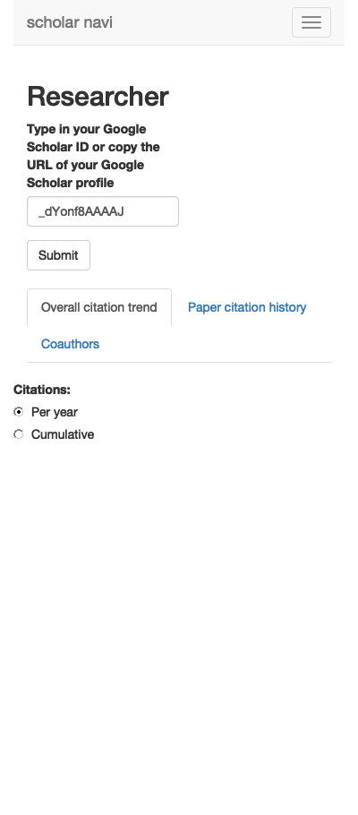

<!-- README.md is generated from README.Rmd. Please edit that file -->

# Scholar Navi

<!-- badges: start -->

[](https://lifecycle.r-lib.org/articles/stages.html#experimental)
<!-- badges: end -->

With the Scholar Navi app you can browse and visualise the data from
Google Scholar. The app is written in R/Shiny and takes advantage of the
[scholar](https://cran.r-project.org/web/packages/scholar/index.html) R
package.

The app displays:

- the citation history of a researcher,
- the citation history of researcher’s top publications,
- the co-author network,
- the citation history of a collection of papers (stored in a Google
  Docs spreadsheet),
- a comparison between researchers.

## Installation

You can install the development version of the Scholar Navi app in R
like so:

``` r
library(devtools)
devtools::install_github("dmattek/shiny-scholar-navi")
```

## Running the app

To run the app, type:

``` r
library(scholarNaviApp)
scholarNaviApp::run_app()
#> Loading required package: shiny
#> 
#> Listening on http://127.0.0.1:6268
#> mod_researcher_server
#> mod_Researcher_server:plotCitationTrend
#> mod_Researcher_server:rfProcessURL
#> mod_collection_server
```


